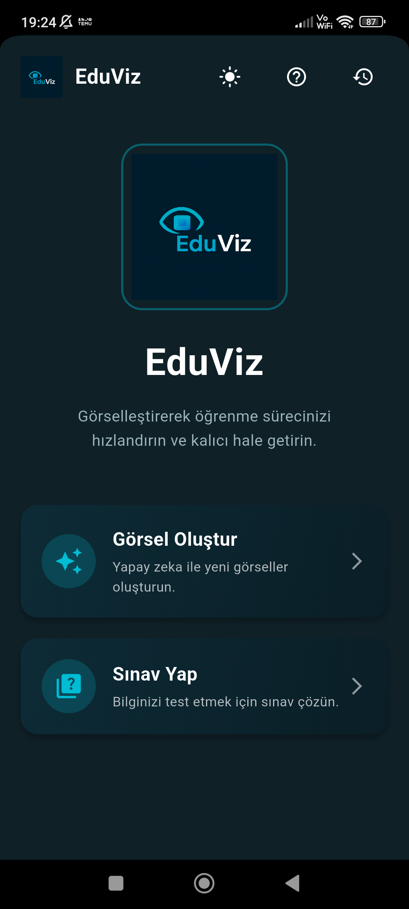
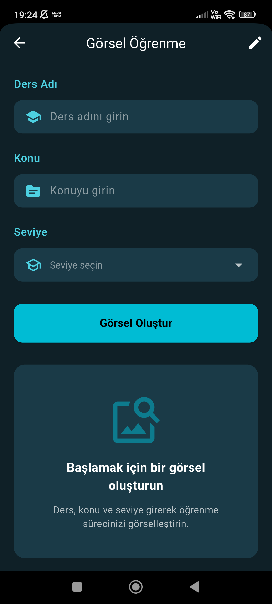
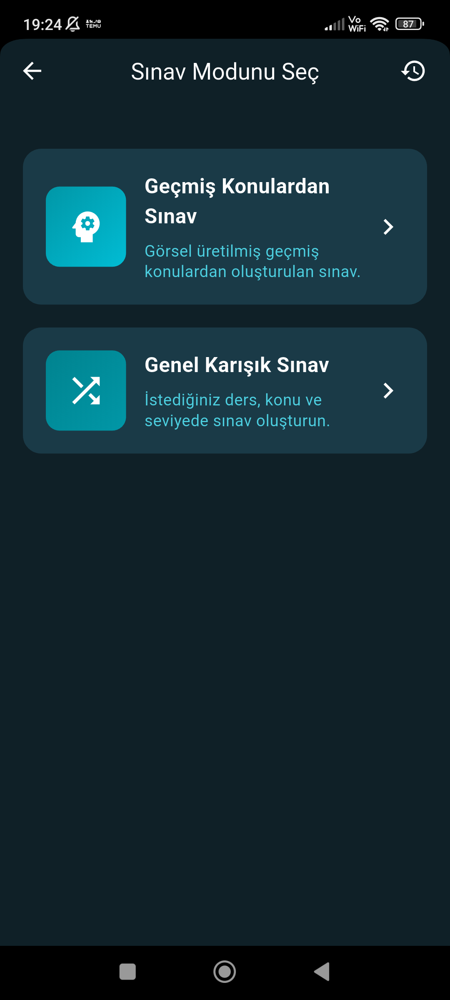
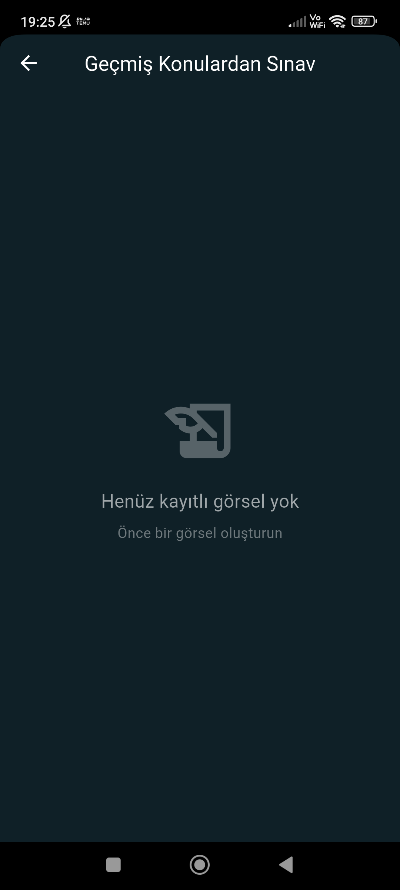
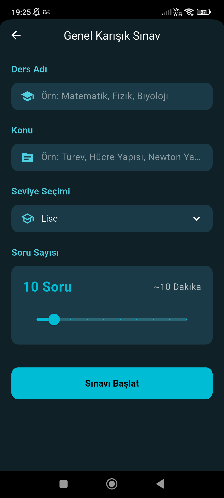

# 📚 EduVision - Görsel Destekli Öğrenme Asistanı

## ⚠️ ÖNEMLİ NOTLAR
🔒 Bu proje ticari bir üründür ve tüm hakları saklıdır.
- Bu repository yalnızca portföy ve vitrin amaçlıdır
- Kaynak kod görüntüleme amacıyla paylaşılmaktadır
- Hiçbir kullanım, kopyalama veya dağıtım hakkı verilmemektedir
- API anahtarları ve hassas bilgiler güvenlik nedeniyle kaldırılmıştır
- Proje aktif olarak geliştirilmekte ve kullanılmaktadır

Lisans bilgileri için [LICENSE](LICENSE) dosyasına bakınız.

---

## 🎯 Proje Hakkında

EduVision, modern mobil uygulama geliştirme teknolojilerini kullanarak oluşturulmuş, production-ready ticari bir eğitim platformudur:

**Görselleştirerek Öğrenme**: AI destekli görsel içerik oluşturma ile öğrenme sürecinizi hızlandırın ve kalıcı hale getirin.

### Teknik Altyapı
- **Cross-platform** mobil uygulama (iOS & Android)
- **AI-powered** görsel oluşturma sistemi
- **Gerçek zamanlı** çizim ve not alma
- **Akıllı sınav** sistemi ve performans analizi
- **Offline-first** mimari ile kesintisiz kullanım

### Proje Durumu
- ✅ Production-ready
- ✅ Aktif geliştirme
- ✅ Gerçek kullanıcılar tarafından kullanılıyor
- ✅ Sürekli güncelleniyor

---

## 🛠️ Teknoloji Stack

### 📱 Frontend (Flutter)
```
├── Framework         : Flutter 3.10+ / Dart
├── State Management  : Provider Pattern
├── Local Storage     : Shared Preferences, Secure Storage
├── UI Components     : Custom Material Design
├── Drawing Engine    : Custom Canvas Implementation
├── Image Processing  : AI-powered Image Generation
└── Navigation        : Flutter Navigator 2.0
```

### 🎨 Key Technical Highlights
- **Clean Architecture**: Feature-based modular structure
- **State Management**: Efficient state handling with Provider
- **Responsive Design**: Adaptive layouts for tablets and phones
- **Offline Support**: Local caching and data persistence
- **Performance**: Optimized rendering, lazy loading
- **Custom Drawing**: Advanced canvas-based drawing system
- **AI Integration**: Intelligent visual content generation
- **Exam System**: Smart question generation and analytics

---

## 🚫 Kurulum ve Kullanım

> [!WARNING]
> Bu repository yalnızca **vitrin amaçlıdır**. Kaynak kodlar görüntüleme için paylaşılmıştır.
> Proje çalıştırılamaz ve kullanılamaz çünkü:
> - API anahtarları ve yapılandırma dosyaları kaldırılmıştır
> - Backend servisleri dahil edilmemiştir
> - Üçüncü parti servis entegrasyonları devre dışıdır

---

## ✨ Özellikler

### 🎨 Ana Özellikler
- **AI Destekli Görsel Oluşturma**: Ders ve konulara özel görsel içerikler oluşturun
- **Gelişmiş Çizim Aracı**: Notlarınızı ve fikirlerinizi çizerek ifade edin
  - Renk paleti seçimi
  - Fırça kalınlığı ayarlama
  - Geri alma/yineleme
  - Temizleme ve kaydetme
- **Akıllı Geçmiş Sistemi**: Önceden oluşturduğunuz tüm görsellere kolayca erişin
  - Tarih bazlı filtreleme
  - Ders bazlı arama
  - Favori işaretleme
- **Kapsamlı Sınav Modu**: Öğrendiklerinizi test edin ve pekiştirin
  - Konu bazlı sınavlar
  - Genel karışık sınavlar
  - Seviye seçimi (İlkokul, Ortaokul, Lise, Üniversite)
  - Zamanlayıcı ve ilerleme takibi
  - Detaylı performans analizi
- **Modern UI/UX**: Karanlık/Aydınlık tema desteği
- **Çoklu Platform**: iOS ve Android desteği

### 📱 Ekran Yapısı

1. **Ana Sayfa (Home Screen)**
   - Hızlı görsel oluşturma
   - Geçmiş görsellere erişim
   - Sınav moduna geçiş
   - İstatistikler ve ilerleme

2. **Görsel Oluşturma Ekranı**
   - Ders adı ve konu girişi
   - AI destekli görsel üretimi
   - Çizim sayfasına geçiş
   - Önizleme ve kaydetme

3. **Geçmiş Görseller**
   - Grid/List görünüm
   - Filtreleme seçenekleri
   - Arama fonksiyonu
   - Favorilere ekleme
   - Paylaşma özellikleri

4. **Çizim Sayfası**
   - Gelişmiş renk seçici
   - Fırça kalınlığı kontrolü
   - Geri alma ve yineleme
   - Temizleme ve kaydetme
   - Dışa aktarma

5. **Sınav Modu**
   - Konu seçimi
   - Seviye belirleme
   - Soru sayısı ayarlama
   - Geçmiş sınav sonuçları

6. **Sınav Ekranı**
   - Zamanlayıcı
   - İlerleme göstergesi
   - Çoktan seçmeli sorular
   - Soru işaretleme
   - Navigasyon

7. **Sınav Sonuç Ekranı**
   - Detaylı performans analizi
   - Doğru/Yanlış cevaplar
   - Açıklamalar ve öneriler
   - İstatistikler
   - Paylaşma seçenekleri

8. **Ayarlar**
   - Tema değiştirme
   - Bildirim ayarları
   - Dil seçenekleri
   - Hakkında ve gizlilik politikası
   - Hesap yönetimi

---

## 📁 Proje Yapısı

```
lib/
├── main.dart                      # Ana uygulama giriş noktası
├── screens/                       # Uygulama ekranları
│   ├── home_screen.dart          # Ana sayfa
│   ├── create_visual_screen.dart # Görsel oluşturma
│   ├── history_screen.dart       # Geçmiş görseller
│   ├── drawing_screen.dart       # Çizim aracı
│   ├── exam_mode_screen.dart     # Sınav modu seçimi
│   ├── create_exam_screen.dart   # Sınav oluşturma
│   ├── exam_screen.dart          # Sınav ekranı
│   ├── exam_result_screen.dart   # Sonuç ekranı
│   └── settings_screen.dart      # Ayarlar
├── widgets/                       # Yeniden kullanılabilir widgetlar
│   ├── custom_button.dart
│   ├── visual_card.dart
│   └── exam_question_card.dart
├── models/                        # Veri modelleri
│   ├── visual_model.dart
│   ├── exam_model.dart
│   └── question_model.dart
├── services/                      # Servis katmanı
│   ├── storage_service.dart
│   ├── ai_service.dart
│   └── exam_service.dart
└── utils/                         # Yardımcı fonksiyonlar
    ├── constants.dart
    ├── theme.dart
    └── helpers.dart
```

---

## 🔐 Güvenlik ve Mimari

### Enterprise-Level Güvenlik
- Secure local storage encryption
- API key management
- Data validation and sanitization
- Secure communication protocols

### Performans Optimizasyonları
- Lazy loading for images
- Efficient state management
- Memory optimization
- Background processing for AI tasks

### Scalability
- Modular architecture
- Feature-based organization
- Reusable components
- Clean separation of concerns

---

## 🎨 Tasarım Sistemi

### Renk Paleti
- **Primary**: `#00BCD4` (Cyan) - Ana marka rengi
- **Secondary**: `#0097A7` (Dark Cyan) - İkincil vurgular
- **Background (Dark)**: `#0F2027` - Karanlık tema arka plan
- **Surface (Dark)**: `#1A3A47` - Kart ve yüzeyler
- **Accent**: `#4DD0E1` (Light Cyan) - Vurgu rengi
- **Success**: `#4CAF50` - Başarı mesajları
- **Error**: `#F44336` - Hata mesajları
- **Warning**: `#FF9800` - Uyarı mesajları

### Tipografi
- **Başlıklar**: Bold, 24-32px
- **Alt Başlıklar**: Semi-bold, 18-20px
- **Gövde Metni**: Regular, 14-16px
- **Küçük Metin**: Regular, 12px

---

## 📱 Uygulama Önizlemesi

<div align="center">

### Ana Özellikler ve Ekranlar

</div>

<table>
  <tr>
    <td width="33%" align="center">
      
      <br/>
      <b>🏠 Ana Sayfa</b>
      <br/>
      Modern ve kullanıcı dostu arayüz
    </td>
    <td width="33%" align="center">
      
      <br/>
      <b>🎨 Görsel Oluşturma</b>
      <br/>
      AI destekli görsel üretimi
    </td>
    <td width="33%" align="center">
      
      <br/>
      <b>✏️ Çizim Aracı</b>
      <br/>
      Gelişmiş çizim özellikleri
    </td>
  </tr>
  <tr>
    <td width="50%" align="center">
      
      <br/>
      <b>📝 Sınav Modu</b>
      <br/>
      Akıllı sınav sistemi
    </td>
    <td width="50%" align="center">
      
      <br/>
      <b>❓ Sınav Ekranı</b>
      <br/>
      İnteraktif sınav deneyimi
    </td>
  </tr>
</table>

<div align="center">

### ✨ Öne Çıkan Özellikler

**AI Destekli Görsel Oluşturma** • **Gelişmiş Çizim Aracı** • **Akıllı Sınav Sistemi**

**Offline Çalışma** • **Karanlık/Aydınlık Tema** • **Performans Analizi**

</div>


---

## 📄 Ek Dökümanlar

- [Gizlilik Politikası](PRIVACY.md) - Kullanıcı verilerinin korunması
- [Kullanım Koşulları](TERMS.md) - Uygulama kullanım şartları
- [Sık Sorulan Sorular](FAQ.md) - Yaygın sorular ve cevaplar

---

## 📄 Lisans ve Telif Hakları

### Kısıtlamalar
- ❌ Ticari kullanım yasaktır
- ❌ Kod kopyalama ve dağıtım yasaktır
- ❌ Türev eserler oluşturma yasaktır
- ✅ Yalnızca görüntüleme ve inceleme için

### İzinler için İletişim
Ticari kullanım veya lisanslama için lütfen iletişime geçin.

---

## 🙏 Kullanılan Teknolojiler

Bu proje aşağıdaki açık kaynak teknolojileri ve kütüphaneleri kullanmaktadır:

- [Flutter](https://flutter.dev/) - UI Framework
- [Dart](https://dart.dev/) - Programming Language
- [Material Design](https://material.io/) - Design System
- [Shared Preferences](https://pub.dev/packages/shared_preferences) - Local Storage
- [Flutter SVG](https://pub.dev/packages/flutter_svg) - SVG Support

---

## 📊 Repository İstatistikleri

- **Dil**: Dart (Flutter)
- **Platform**: iOS, Android
- **Durum**: Active Development
- **Lisans**: Proprietary (All Rights Reserved)

---

## 📞 İletişim

Sorularınız, geri bildirimleriniz veya iş birliği teklifleri için:

- **GitHub**: [@davutcan15081](https://github.com/davutcan15081)
- **Email**: [İletişim için GitHub profilinden ulaşın]

---

<div align="center">

**EduVision** ile öğrenme deneyiminizi görselleştirin! 📚✨

Made with ❤️ using Flutter

</div>
